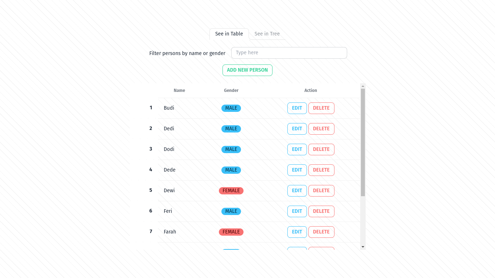
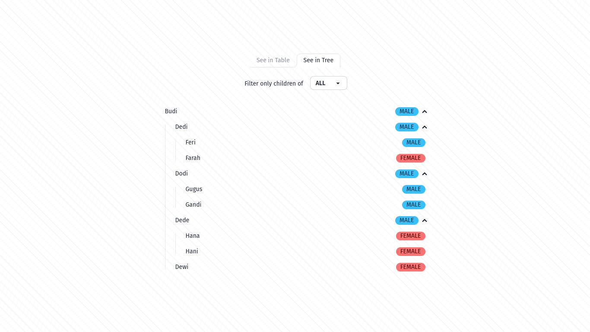

<p align="center"><a href="https://laravel.com" target="_blank"></a></p>

## Overview

Simple family tree web application with a single parent each.

### Technical Details

- Backend: `PHP`, `Laravel`, `RDBMS` (eg: `MySQL`)
- Frontend: `Alpine.js`, `TypeScript`, `TailwindCSS`, `daisyUI`

## Installation

- Requirements:
  - `PHP >= 8.1`
  - Relational Database, for example one from the following list:
    - `MySQL >= 8.0`
    - `MariaDB >= 10.2`
    - `PostgreSQL >= 9.4`
    - `SQLite >= 3.8.3`
    - `SQL Server >= 2008`
- Clone this repository to your local machine
  ```
  git clone https://github.com/yusuftaufiq/simple-tree.git
  ```
- Change your active directory to the cloned folder
- Copy sample environment files from `.env.example` to `.env`
- Configure database configuration in `.env` which has `DB_` prefix, for example:
  ```
  DB_CONNECTION=mysql
  DB_HOST=127.0.0.1
  DB_PORT=3306
  DB_DATABASE=family_tree
  DB_USERNAME=root
  DB_PASSWORD=password
  ```
- Install all dependencies with
  ```
  composer install
  npm install
  ```
- Set app key
  ```
  php artisan key:generate
  ```
- Run database migration
  ```
  php artisan migrate
  ```
- Serve the application on the PHP development server
  ```
  php artisan serve
  ```
- Run the vite development server
  ```
  npm run dev
  ```
- Finally, open your browser and visit your application URL (use `http://127.0.0.1:8000` by default)
- Additionally, you can run the following additional commands
  - `php artisan db:seed`: seed database with default hierarchy tree as shown below:
    
    
  - `php artisan db:seed --class PersonSeeder`: seed database with hierarchical trees of random persons
  - `npm run format`: run code formatter tool using Prettier and Laravel Pint, this command will format the following file extensions automatically:
    - `*.php`: with Laravel Pint using PSR 12 code style
    - `*.blade.php`: with a Prettier [Blade Formatter](https://github.com/shufo/blade-formatter)
    - `*.css`, `*.js`, `*.ts`, `*.json`, `*.xml`, `*.md`: with the default Prettier configuration
  - `npm run lint`: run static code analyzer using PHPStan, ESLint, TypeScript check
  - `npm run build`

## Usage

### Via Browser

Visit the root URL path in your browser like `http://127.0.0.1:8000`

### Via API

- `[POST] /api/persons`: create a new person, for example with curl
  ```
  curl -H 'content-type: application/json' -H 'accept: application/json' -v -X POST -d '{"name": "Joko", "gender": "MALE", "parent_id": null}' http://127.0.0.1:8000/api/persons
  ```
- `[GET] /api/persons`: get persons, for example with curl
  ```
  curl -H 'content-type: application/json' -H 'accept: application/json' -v -X GET http://127.0.0.1:8000/api/persons
  ```
- `[GET] /api/persons/{:id}` : show person by id, for example with curl
  ```
  curl -H 'content-type: application/json' -H 'accept: application/json' -v -X GET http://127.0.0.1:8000/api/persons/1
  ```
- `[PUT] /api/persons/{:id}`: replace person data by id, for example with curl
  ```
  curl -H 'content-type: application/json' -H 'accept: application/json' -v -X PUT -d '{"name": "Jojo", "gender_id": "MALE", "parent_id": 10}' http://127.0.0.1:8000/api/persons/1
  ```
- `[DELETE] /api/persons/{:id}`: delete person by id, for example with curl
  ```
  curl -H 'content-type: application/json' -H 'accept: application/json' -v -X DELETE http://127.0.0.1:8000/api/persons/1
  ```
